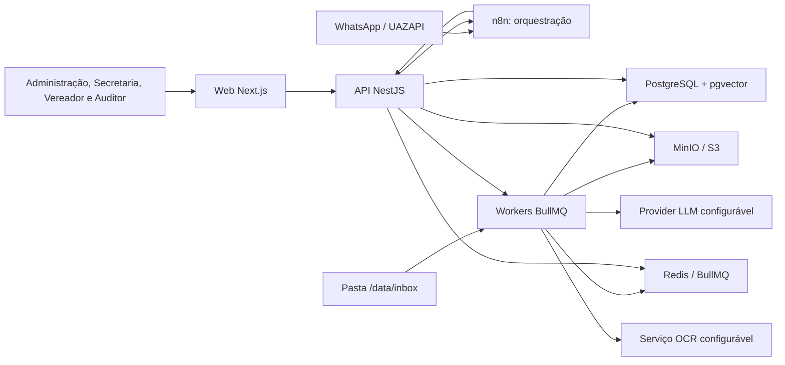
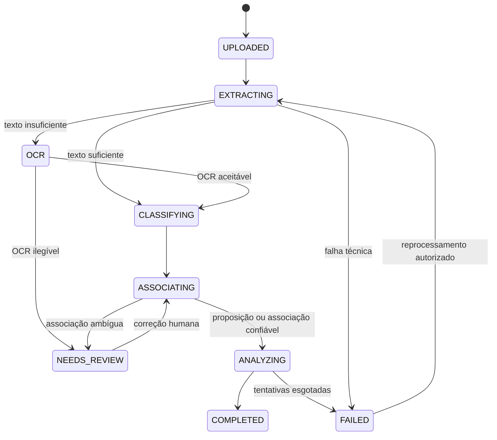

# Fiscaliza AI — Arquitetura

## 1. Objetivo e princípios

O Fiscaliza AI é um sistema interno, multiusuário e auditável para receber proposições legislativas e respostas do Executivo, controlar prazos, decompor solicitações em itens verificáveis, analisar respostas com evidências por página e oferecer consulta contextual na web e no WhatsApp.

Princípios que orientam todas as decisões:

1. **Dados estruturados antes de RAG.** Proposição, item solicitado, resposta, análise e evidência são entidades persistidas; o chat é uma forma adicional de consulta.
2. **Autorização determinística.** IA nunca participa de decisões de acesso.
3. **Evidência obrigatória.** Conclusões factuais devem apontar documento, página e, quando possível, trecho curto.
4. **Revisão humana sem perda do original.** Resultados da IA são imutáveis como registro histórico; a visão corrente pode ser revisada com justificativa e auditoria.
5. **Processamento assíncrono e recuperável.** Upload não depende da disponibilidade imediata de OCR, LLM ou WhatsApp.
6. **Configuração, não constantes.** Prazos, confiança, timezone, feriados, providers e limites operacionais ficam em configurações tipadas.
7. **Privacidade por padrão.** Todo acesso é negado até que uma política explícita o permita.

## 2. Contexto do sistema



O n8n não contém regras de autorização, associação, prazo ou análise. Ele valida o envelope básico, chama endpoints autenticados do backend e entrega mensagens na UAZAPI.

## 3. Monorepo e responsabilidades

```text
apps/
  api/                       # NestJS: REST, regras, autenticação e consumidores BullMQ
  web/                       # Next.js: interface responsiva e acessível
packages/
  database/                  # Prisma schema, migrations, seed e PrismaClient
  shared/                    # contratos, enums, utilitários e schemas sem dependência de framework
  ai/                        # LLMProvider, providers, prompts, schemas, retry e cache
  document-processing/       # checksum, PDF, OCR, páginas, chunks e associação
infra/
  docker/                    # Dockerfiles e scripts de inicialização
  n8n/                       # exemplos importáveis e contratos dos workflows
docs/                        # decisões e operação
data/inbox/                  # entrada local; ignorada pelo Git
```

As dependências apontam para dentro: `apps/*` pode depender de `packages/*`; `shared` não depende de aplicações; `ai` e `document-processing` dependem de contratos compartilhados, não de controllers.

## 4. Componentes do backend

| Módulo                             | Responsabilidade                                              |
| ---------------------------------- | ------------------------------------------------------------- |
| `AuthModule`                       | login, refresh token rotativo, revogação e identidade atual   |
| `AuthorizationModule`              | RBAC e escopo por autoria/classificação                       |
| `UsersModule` / `CouncilorsModule` | usuários, papéis, mandatos e identidades WhatsApp             |
| `PropositionsModule`               | requerimentos, indicações, itens e visão agregada             |
| `DocumentsModule`                  | upload, metadados, checksum, URLs assinadas e páginas         |
| `ResponsesModule`                  | respostas 1:N, associação automática/manual e complementações |
| `AnalysesModule`                   | análise estruturada, revisões, evidências e resumo executivo  |
| `DeadlinesModule`                  | cálculo configurável, prorrogações, estados e alertas         |
| `WhatsappModule`                   | idempotência, sessão Redis, contexto e respostas              |
| `NotificationsModule`              | outbox, tentativas, entrega e falhas recuperáveis             |
| `SettingsModule`                   | configurações tipadas, versionadas e auditadas                |
| `AuditModule`                      | trilha append-only de ações relevantes                        |
| `HealthModule`                     | liveness/readiness de API, PostgreSQL, Redis e MinIO          |
| `JobsModule`                       | filas, retries, backoff, dead-letter e métricas               |

Controllers só autenticam, validam, autorizam e delegam. Processamento de PDF, OCR, embeddings e LLM ocorre em jobs idempotentes.

## 5. Fluxo documental



1. API ou inbox recebe o PDF.
2. O serviço calcula SHA-256 em streaming e rejeita duplicata lógica sem duplicar o objeto.
3. O original é salvo no MinIO; o PostgreSQL guarda apenas metadados e `storageKey`.
4. Extração preserva páginas. OCR só roda em páginas com densidade de texto insuficiente.
5. Classificação extrai tipo, número, ano, autoria, datas, protocolo, assunto e referências com confiança por campo.
6. Associação usa sinais determinísticos primeiro e semânticos depois. Resultados abaixo do limiar ficam em `NEEDS_REVIEW`.
7. Proposições são decompostas; respostas são analisadas item a item; embeddings são gerados por página/chunk.
8. `AnalysisCompleted` é persistido na mesma transação que o evento de outbox. Só depois a notificação pode ser enviada.

## 6. Eventos, filas e consistência

Filas BullMQ planejadas:

- `document-ingestion`: checksum, armazenamento e registro;
- `document-extraction`: texto por página e OCR condicional;
- `document-classification`: tipo e metadados;
- `document-association`: candidatos e decisão;
- `analysis`: decomposição, resposta item a item e resumo;
- `embeddings`: chunks e vetores;
- `notifications`: chamadas n8n/UAZAPI;
- `deadlines`: recálculo e alertas.

Eventos de domínio são gravados em uma **transactional outbox** e publicados por worker. Cada consumidor registra idempotência por `eventId` ou chave de negócio. Jobs têm tentativas limitadas, backoff exponencial e estado consultável. Falha externa nunca remove o documento nem duplica mensagem.

Eventos iniciais: `DocumentUploaded`, `DocumentProcessed`, `PropositionCreated`, `ResponseAssociated`, `AnalysisStarted`, `AnalysisCompleted`, `ResponseAnalysisCompleted`, `DeadlineApproaching`, `DeadlineExpired` e `NotificationRequested`.

## 7. Autorização e escopo de dados

| Papel         | Escopo padrão                                                                   |
| ------------- | ------------------------------------------------------------------------------- |
| `ADMIN`       | administração, configurações e todos os registros permitidos pela classificação |
| `SECRETARIAT` | ingestão, cadastro, correção, associação e revisão                              |
| `COUNCILOR`   | suas proposições e documentos explicitamente compartilhados                     |
| `AUDITOR`     | leitura e auditoria; sem alteração de resultado                                 |

Toda query de documento, chunk, análise e conversa recebe um `AccessScope` construído no backend. A recuperação vetorial inclui filtros SQL por IDs autorizados antes da ordenação por distância. URLs do MinIO são curtas e assinadas após a mesma verificação.

## 8. API e contratos

- Prefixo: `/api`; versão inicial por URI: `/api/v1`.
- Swagger em `/api/docs` apenas conforme configuração do ambiente.
- DTOs validados por `class-validator`; resultados e contratos de IA validados por Zod.
- Erros seguem Problem Details (`application/problem+json`) com `requestId` e sem segredos.
- Paginação por cursor nos registros de alto volume; filtros e ordenação com allowlist.
- Endpoints pesados retornam `202 Accepted` e um identificador de job.

Grupos previstos: `auth`, `users`, `councilors`, `propositions`, `documents`, `responses`, `analyses`, `deadlines`, `notifications`, `integrations/whatsapp`, `settings`, `audit` e `health`.

## 9. Observabilidade

- Logs JSON com `requestId`, `userId`, `jobId`, `documentId` e `analysisId`, com redação de tokens e conteúdo sensível.
- Métricas de duração e falha por etapa, profundidade de fila, latência/uso de IA e entrega de notificações.
- `/health/live` verifica processo; `/health/ready` verifica PostgreSQL, Redis e MinIO; `/health` fornece resumo autenticável/seguro.
- Preparação para OpenTelemetry e Sentry sem acoplamento obrigatório no MVP.

## 10. Disponibilidade e recuperação

PostgreSQL é a fonte de verdade. MinIO requer versionamento/backup; Redis é reconstruível, exceto sessões temporárias. Backups precisam ser testados com restauração. A outbox permite retomar eventos após indisponibilidade. Migrações são aplicadas antes da troca da aplicação e devem ser compatíveis com rollback de binário quando possível.

## 11. Decisões registradas

| Decisão           | Escolha inicial                                              | Motivo                                                      |
| ----------------- | ------------------------------------------------------------ | ----------------------------------------------------------- |
| Monorepo          | pnpm workspaces + Turborepo                                  | cache, contratos compartilhados e execução uniforme         |
| API               | NestJS REST                                                  | módulos explícitos, DI e Swagger                            |
| Banco             | PostgreSQL 16 + pgvector                                     | transações e busca semântica no mesmo escopo de autorização |
| ORM               | Prisma                                                       | schema central, migrations e client tipado                  |
| Arquivos          | MinIO/S3                                                     | objetos fora do banco e URLs assinadas                      |
| Fila/sessão       | Redis + BullMQ                                               | jobs recuperáveis e sessão curta do WhatsApp                |
| Auth              | access JWT curto + refresh opaco rotativo em cookie HttpOnly | revogação e menor exposição no navegador                    |
| Auditoria/eventos | audit append-only + transactional outbox                     | rastreabilidade e entrega confiável                         |
| IA                | interface `LLMProvider`; Anthropic primeiro                  | troca de provider/modelo sem regra no SDK                   |
| Datas             | `timestamptz` em UTC + timezone IANA configurado             | cálculo local correto e persistência inequívoca             |

## 12. Árvore proposta

```text
fiscaliza-ai/
├─ apps/
│  ├─ api/src/{auth,authorization,councilors,health,settings,common}/
│  └─ web/src/{app,components,lib}/
├─ packages/
│  ├─ database/{prisma,src}/
│  ├─ shared/src/
│  ├─ ai/src/{providers,prompts,schemas}/
│  └─ document-processing/src/
├─ infra/
│  ├─ docker/
│  └─ n8n/{workflows,examples}/
├─ docs/
├─ tests/fixtures/
├─ data/inbox/
├─ docker-compose.yml
├─ .env.example
├─ package.json
├─ pnpm-workspace.yaml
└─ turbo.json
```

Detalhes de fases, riscos e decisões pendentes estão em `IMPLEMENTATION_PLAN.md`.
