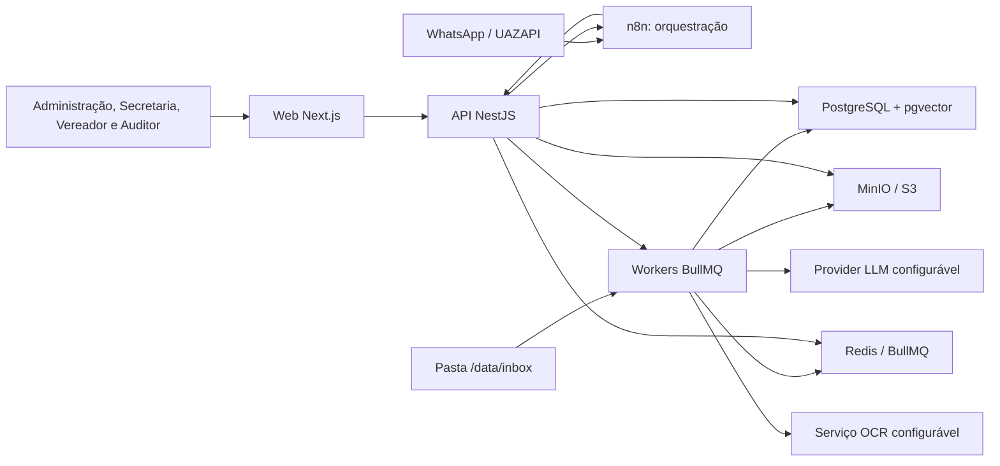
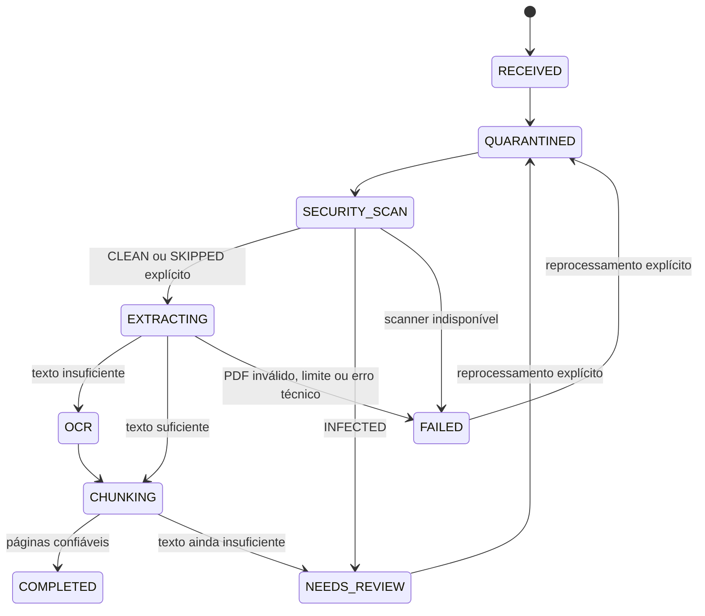
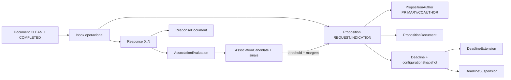
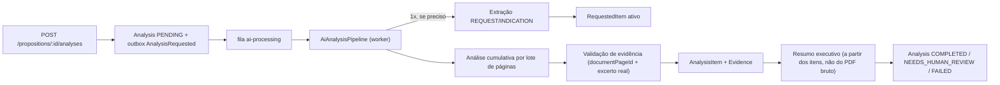

# Fiscaliza AI — Arquitetura

## 1. Objetivo e princípios

O Fiscaliza AI é um sistema interno, multiusuário e auditável para receber proposições legislativas e respostas do Executivo, controlar prazos, decompor solicitações em itens verificáveis, analisar respostas com evidências por página e oferecer consulta contextual na web e no WhatsApp.

Princípios que orientam todas as decisões:

1. **Dados estruturados antes de RAG.** Proposição, item solicitado, resposta, análise e evidência são entidades persistidas; o chat é uma forma adicional de consulta.
2. **Autorização determinística.** IA nunca participa de decisões de acesso.
3. **Evidência obrigatória.** Conclusões factuais devem apontar documento, página e, quando possível, trecho curto.
4. **Revisão humana sem perda do original.** Resultados da IA são imutáveis como registro histórico; a visão corrente pode ser revisada com justificativa e auditoria.
5. **Processamento assíncrono e recuperável.** Upload não depende da disponibilidade imediata de OCR, LLM ou WhatsApp.
6. **Configuração, não constantes.** Prazos, confiança, timezone, feriados, providers e limites operacionais ficam em configurações tipadas.
7. **Privacidade por padrão.** Todo acesso é negado até que uma política explícita o permita.

## 2. Contexto do sistema



O n8n não contém regras de autorização, associação, prazo ou análise. Ele valida o envelope básico, chama endpoints autenticados do backend e entrega mensagens na UAZAPI.

## 3. Monorepo e responsabilidades

```text
apps/
  api/                       # NestJS: REST, regras, autenticação, autorização e outbox
  web/                       # Next.js: interface responsiva e acessível
  worker/                    # BullMQ: segurança, PDF, OCR, chunks, outbox e inbox
packages/
  database/                  # Prisma schema, migrations, seed e PrismaClient
  shared/                    # contratos, enums, utilitários e schemas sem dependência de framework
  ai/                        # LLMProvider, providers, prompts, schemas, retry e cache
  document-processing/       # checksum, PDF, OCR, páginas, chunks e associação
infra/
  docker/                    # Dockerfiles e scripts de inicialização
  n8n/                       # exemplos importáveis e contratos dos workflows
docs/                        # decisões e operação
data/inbox/                  # entrada local; ignorada pelo Git
```

As dependências apontam para dentro: `apps/*` pode depender de `packages/*`; `shared` não depende de aplicações; `ai` e `document-processing` dependem de contratos compartilhados, não de controllers.

## 4. Componentes do backend

| Módulo                             | Responsabilidade                                                                                 |
| ---------------------------------- | ------------------------------------------------------------------------------------------------ |
| `AuthModule`                       | login, refresh token rotativo, revogação e identidade atual                                      |
| `AuthorizationModule`              | RBAC e escopo por autoria/classificação                                                          |
| `UsersModule` / `CouncilorsModule` | usuários, papéis, mandatos e identidades WhatsApp                                                |
| `PropositionsModule`               | requerimentos/indicações, coautoria, documentos e timeline                                       |
| `DocumentsModule`                  | upload, metadados, checksum, URLs assinadas e páginas                                            |
| `ResponsesModule`                  | respostas 1:N, complementações, retificações e documentos                                        |
| `AssociationsModule`               | candidatos determinísticos, decisão e revisão manual                                             |
| `AnalysesModule`                   | extração/análise estruturada, revisão humana append-only, evidências e resumo executivo (Fase 4) |
| `DeadlinesModule`                  | política/snapshot, prorrogações, suspensões e estados                                            |
| `HolidaysModule`                   | calendário administrativo por escopo                                                             |
| `WhatsappModule`                   | idempotência, sessão Redis, contexto e respostas                                                 |
| `NotificationsModule`              | outbox, tentativas, entrega e falhas recuperáveis                                                |
| `SettingsModule`                   | configurações tipadas, versionadas e auditadas                                                   |
| `AuditModule`                      | trilha append-only de ações relevantes                                                           |
| `HealthModule`                     | liveness/readiness de API, PostgreSQL, Redis e MinIO                                             |
| `JobsModule`                       | filas, retries, backoff, dead-letter e métricas                                                  |

Controllers só autenticam, validam, autorizam e delegam. Processamento de PDF, OCR, embeddings e LLM ocorre em jobs idempotentes.

## 5. Fluxo documental



1. API ou inbox passa o PDF ao mesmo `DocumentIngestionService`.
2. O serviço valida extensão/MIME/magic bytes, calcula SHA-256 em streaming e evita duplicata lógica e física.
3. O original entra em `quarantine/{documentId}/original.pdf`; a transação grava documento, tentativa, auditoria e outbox.
4. O dispatcher publica um job BullMQ determinístico. O worker executa ClamAV, promove somente arquivos `CLEAN` e extrai cada página física isoladamente.
5. `TextQualityAnalyzer` decide OCR por página. Poppler e Tesseract recebem somente as páginas necessárias, com timeout e concorrência próprios.
6. O worker escolhe `effectiveText` deterministicamente, cria chunks restritos à página e mantém `embedding = NULL`.
7. Falhas e páginas ilegíveis são consultáveis e reprocessáveis por nova tentativa, sem apagar o histórico anterior.

Na Fase 3, a classificação operacional e a associação foram adicionadas na API como regras determinísticas. O worker documental continua sem classificar por IA. Cada reprocessamento cria uma tentativa cujas páginas/chunks são imutáveis; somente os derivados da tentativa corrente são substituídos durante seu processamento. `AnalysisDocument` e `Evidence` já estão preparados para apontar uma tentativa/página exata, conforme `adr/ADR-001-DOCUMENT-PROCESSING-VERSIONING.md`.

## 5.1. Camada legislativa determinística



- um arquivo é entidade distinta do evento administrativo que representa;
- somente documentos `CLEAN` e `COMPLETED` podem receber vínculos operacionais;
- regex apenas sugere tipo/número/ano e nunca cria proposição automaticamente;
- associação automática exige simultaneamente score e margem configurados; empate ou ambiguidade vira revisão;
- correções manuais usam versão otimista e geram revisão append-only;
- `RESPONSE_RECEIVED` significa protocolo/associação recebida, não atendimento integral;
- a política de prazo é separada por tipo e copiada integralmente no `Deadline` na criação.

## 5.2. Camada semântica de IA (Fase 4)



A IA nunca é a fonte da verdade: ela produz interpretação estruturada sobre `Proposition`/`Response`/`DocumentPage` já persistidos. `AI_PROCESSING_ENABLED=false` (padrão) faz a criação de análise falhar de forma explícita e recuperável, sem chamada externa. Ver `docs/ANALYSIS_PIPELINE.md` e `docs/AI_EVIDENCE_VALIDATION.md`.

## 6. Eventos, filas e consistência

Fila BullMQ implementada:

- `document-processing`: job tipado por documento/tentativa, segurança, extração, OCR e chunks;

Fila BullMQ adicionada na Fase 3:

- `deadline-maintenance`: varredura repetível e idempotente de `DUE_SOON`/`OVERDUE`.

Fila BullMQ adicionada na Fase 4:

- `ai-processing`: job único `analyze`, `jobId` determinístico `analysis:{analysisId}:input:{inputHash}`, consumindo o evento outbox `AnalysisRequested`. Executa extração (quando ainda não houver `RequestedItem` ativo), análise cumulativa de respostas e resumo executivo. Ver `docs/ANALYSIS_PIPELINE.md`.

Filas futuras planejadas:

- `document-classification`: tipo e metadados;
- `document-association`: candidatos e decisão;
- `embeddings`: chunks e vetores;
- `notifications`: chamadas n8n/UAZAPI;
- `deadlines`: recálculo e alertas.

Eventos de domínio são gravados em uma **transactional outbox** e publicados por worker. Cada consumidor registra idempotência por `eventId` ou chave de negócio. Jobs têm tentativas limitadas, backoff exponencial e estado consultável. Falha externa nunca remove o documento nem duplica mensagem.

Eventos já produzidos: `DocumentUploaded`, `DocumentProcessed`, `PropositionCreated`, `ResponseCreated`, `ResponseAssociated`, `DeadlineCreated`, `DeadlineExtended`, `DeadlineApproaching`, `DeadlineExpired`, `AnalysisRequested`, `AnalysisCompleted`, `AnalysisNeedsReview` e `AnalysisFailed`. WhatsApp e notificações externas continuam reservados para a Fase 5; `AnalysisCompleted` é o ponto de extensão que a Fase 5 consumirá para RAG/chat/WhatsApp sem recriar a lógica de fiscalização.

## 7. Autorização e escopo de dados

| Papel         | Escopo padrão                                                                   |
| ------------- | ------------------------------------------------------------------------------- |
| `ADMIN`       | administração, configurações e todos os registros permitidos pela classificação |
| `SECRETARIAT` | ingestão, cadastro, correção, associação e revisão                              |
| `COUNCILOR`   | autoria/coautoria preparada; política de gabinete ainda não exposta na Fase 3   |
| `AUDITOR`     | leitura e auditoria; sem alteração de resultado                                 |

Na operação da Fase 3, `ADMIN`, `SECRETARIAT` e `AUDITOR` consultam a camada legislativa; somente `ADMIN`/`SECRETARIAT` alteram cadastros, associações e prazos. Guards e serviços negam por padrão. O modelo de escopo aceita todos os autores/coautores para a futura política de gabinete, mas essa política não é presumida. URLs do MinIO continuam curtas e assinadas após autorização do backend.

## 8. API e contratos

- Prefixo: `/api`; versão inicial por URI: `/api/v1`.
- Swagger em `/api/docs` apenas conforme configuração do ambiente.
- DTOs validados por `class-validator`; resultados e contratos de IA validados por Zod.
- Erros seguem Problem Details (`application/problem+json`) com `requestId` e sem segredos.
- Paginação por cursor nos registros de alto volume; filtros e ordenação com allowlist.
- Endpoints pesados retornam `202 Accepted` e um identificador de job.

Grupos previstos: `auth`, `users`, `councilors`, `propositions`, `documents`, `responses`, `analyses`, `deadlines`, `notifications`, `integrations/whatsapp`, `settings`, `audit` e `health`.

## 9. Observabilidade

- Logs JSON com `requestId`, `userId`, `jobId`, `documentId` e `analysisId`, com redação de tokens e conteúdo sensível.
- Métricas de duração e falha por etapa, profundidade de fila, latência/uso de IA e entrega de notificações.
- `/health/live` verifica processo; `/health/ready` verifica PostgreSQL, Redis e MinIO; `/health` fornece resumo autenticável/seguro.
- Preparação para OpenTelemetry e Sentry sem acoplamento obrigatório no MVP.

## 10. Disponibilidade e recuperação

PostgreSQL é a fonte de verdade. MinIO requer versionamento/backup; Redis é reconstruível, exceto sessões temporárias. Backups precisam ser testados com restauração. A outbox permite retomar eventos após indisponibilidade. Migrações são aplicadas antes da troca da aplicação e devem ser compatíveis com rollback de binário quando possível.

## 11. Decisões registradas

| Decisão           | Escolha inicial                                              | Motivo                                                      |
| ----------------- | ------------------------------------------------------------ | ----------------------------------------------------------- |
| Monorepo          | pnpm workspaces + Turborepo                                  | cache, contratos compartilhados e execução uniforme         |
| API               | NestJS REST                                                  | módulos explícitos, DI e Swagger                            |
| Banco             | PostgreSQL 16 + pgvector                                     | transações e busca semântica no mesmo escopo de autorização |
| ORM               | Prisma                                                       | schema central, migrations e client tipado                  |
| Arquivos          | MinIO/S3                                                     | objetos fora do banco e URLs assinadas                      |
| Fila/sessão       | Redis + BullMQ                                               | jobs recuperáveis e sessão curta do WhatsApp                |
| Worker documental | aplicação Node separada da API                               | parsing/OCR não bloqueiam nem ampliam o processo HTTP       |
| PDF/OCR           | PDF.js em subprocesso + Poppler/Tesseract por página         | limite de memória/tempo e OCR somente quando necessário     |
| Antivírus         | interface `DocumentSecurityScanner` + ClamAV INSTREAM        | quarentena explícita e implementação substituível           |
| Auth              | access JWT curto + refresh opaco rotativo em cookie HttpOnly | revogação e menor exposição no navegador                    |
| Auditoria/eventos | audit append-only + transactional outbox                     | rastreabilidade e entrega confiável                         |
| Associação        | sinais determinísticos + threshold e margem configuráveis    | decisão explicável e ambiguidade sempre revisável           |
| Prazo             | política por tipo + snapshot por registro                    | mudança administrativa não altera histórico                 |
| Concorrência      | constraints + versão otimista em resposta/prazo              | evita dupla associação/prorrogação                          |
| Derivados PDF     | versionados por `DocumentProcessingAttempt`                  | evidência histórica nunca aponta página substituída         |
| IA                | interface `LLMProvider`; Anthropic primeiro                  | troca de provider/modelo sem regra no SDK                   |
| Datas             | `timestamptz` em UTC + timezone IANA configurado             | cálculo local correto e persistência inequívoca             |

## 12. Árvore proposta

```text
fiscaliza-ai/
├─ apps/
│  ├─ api/src/{auth,authorization,councilors,health,settings,common}/
│  ├─ web/src/{app,components,lib}/
│  └─ worker/{src,scripts}/
├─ packages/
│  ├─ database/{prisma,src}/
│  ├─ shared/src/
│  ├─ ai/src/{providers,prompts,schemas}/
│  └─ document-processing/src/
├─ infra/
│  ├─ docker/
│  └─ n8n/{workflows,examples}/
├─ docs/
├─ tests/fixtures/
├─ data/inbox/
├─ docker-compose.yml
├─ .env.example
├─ package.json
├─ pnpm-workspace.yaml
└─ turbo.json
```

Detalhes de fases, riscos e decisões pendentes estão em `IMPLEMENTATION_PLAN.md`.
