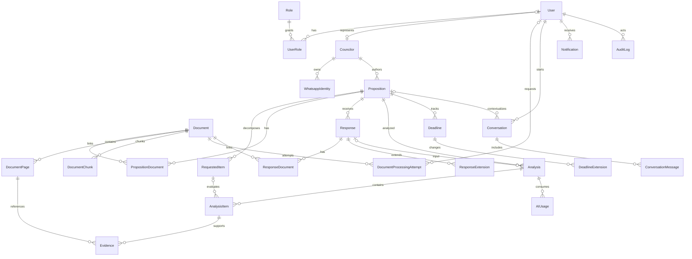

# Fiscaliza AI — Modelo de Dados

## 1. Convenções

- IDs são UUIDs gerados no backend/banco.
- Datas e horas são persistidas como `timestamptz` em UTC; datas administrativas sem horário usam `date`.
- Registros de domínio usam `createdAt`/`updatedAt`; auditoria e versões relevantes são append-only.
- PDFs não são persistidos no PostgreSQL; apenas metadados, hash e chave S3.
- Textos extraídos são separados por página. Um trecho de evidência nunca existe sem `documentId` e `pageNumber` válidos.
- Soft delete é usado apenas onde retenção permitir; documentos e auditoria não são apagados por fluxos comuns.

## 2. Visão relacional

## 3. Identidade e acesso

### `User`

Conta autenticável: `email` único normalizado, `passwordHash`, nome, estado, timestamps de login e revogação. A senha nunca é armazenada ou registrada.

### `Role` e `UserRole`

Papéis iniciais `ADMIN`, `SECRETARIAT`, `COUNCILOR`, `AUDITOR`. A relação N:N evita enum rígido na autorização e permite evolução. O seed cria papéis, não permissões implícitas no frontend.

### `Councilor`

Perfil político/administrativo opcionalmente ligado a um `User`. Guarda nome de exibição, nome legal, partido opcional e período de mandato. A autoria de uma proposição aponta para `Councilor`, não diretamente para `User`.

### `WhatsappIdentity`

Número E.164 normalizado, instância UAZAPI, estado de verificação e vínculo com vereador. `(phoneNumber, instance)` é único. Número desconhecido não cria usuário automaticamente.

## 4. Proposições e documentos

### `Proposition`

Campos centrais: tipo (`REQUEST`/`INDICATION`), número, ano, protocolo, data, autor, destinatário, assunto, resumo e status. A identidade administrativa é pelo menos `(type, number, year)`; há unique constraint com esses campos. Casos excepcionais de numeração duplicada entre órgãos deverão ser resolvidos antes da produção adicionando `originUnit` à chave.

### `RequestedItem`

Item atômico de verificação, com sequência única dentro da proposição, texto original, pergunta/ação normalizada, categoria e tipo esperado de resposta. O tipo de proposição determina qual pipeline o cria. Não há merge automático de perguntas distintas.

### `Document`

Metadados do original: nome sanitizado, MIME validado, `storageKey`, SHA-256 único, tamanho, páginas, origem (`UPLOAD`/`INBOX`), autor do upload, estados de segurança/extração/OCR/processamento, textos agregados opcionais e confiança. Também conserva tentativa corrente, erro seguro, timestamps por etapa e `reviewRequired`. `kind` e `accessLevel` preparam classificação e restrição futuras.

O objeto começa em `quarantine/{documentId}/original.pdf`. Somente após `securityStatus = CLEAN` sua chave muda para `documents/{anoUTC}/{documentId}/original.pdf`. Um resultado `SKIPPED`, `INFECTED` ou `FAILED` não libera download.

### `DocumentPage`

Chave `(documentId, pageNumber)`, `extractedText`, `ocrText`, `effectiveText`, fonte efetiva, quantidade de caracteres, score/razão de qualidade, necessidade/estado/confiança de OCR. Páginas começam em 1 e correspondem à ordem física entregue pelo parser. Evidências futuras referenciam a página persistida, impedindo página fabricada no banco.

### `DocumentProcessingAttempt`

Histórico imutável por `(documentId, attempt)`: gatilho (`UPLOAD`, `INBOX` ou `REPROCESS`), estado, solicitante, erro seguro e timestamps. Reprocessar incrementa a tentativa e recalcula somente páginas/chunks derivados; tentativas e auditorias anteriores permanecem.

### `DocumentChunk`

Trecho derivado de uma única página, com página, sequência, conteúdo e SHA-256. Na Fase 2, `embedding` permanece obrigatoriamente `NULL`. A coluna física existente é `vector(1536)`; provider, dimensão, coluna/índice versionado e estratégia de reindexação precisam de ADR antes da Fase 5.

### Vínculos de documento

`PropositionDocument` e `ResponseDocument` permitem mais de um anexo, distinguem documento principal e preservam ordem. Um mesmo objeto deduplicado pode ser referenciado sem duplicar bytes.

## 5. Respostas e associação

### `Response`

Relação N:1 com proposição, nunca 1:1. Guarda tipo (`INITIAL`, `COMPLEMENTARY`, `RECTIFICATION`, `OTHER`), datas, protocolo, remetente, status de associação, confiança e método (`AUTOMATIC`, `MANUAL`). Uma resposta ambígua pode existir sem `propositionId` até revisão.

### `ResponseExtension`

Registra pedido/comunicação de prorrogação relacionada à resposta: data, novo prazo solicitado, motivo e documento de suporte. Não substitui o histórico formal em `DeadlineExtension`.

### Candidatos de associação

`AssociationCandidate` preserva candidatos e pontuações por sinal (tipo/número/ano, protocolo, autor, assunto, referência textual). A associação automática só ocorre se o melhor candidato superar o limiar e a margem mínima configurada; caso contrário, `NEEDS_REVIEW`.

## 6. Análises, revisões e evidências

### `Analysis`

Uma execução versionada para proposição e, quando aplicável, conjunto/resposta. Guarda tipo, estado, confiança, JSON estruturado de resumo, resultado original, resultado corrente, provider/modelo/prompt/versão e `inputHash`. A chave de cache evita nova chamada equivalente.

### `AnalysisItem`

Resultado por `RequestedItem`. Como os status diferem entre requerimentos e indicações, o banco guarda um enum superset validado também pelo tipo de análise. Mantém resultado original e corrente, explicação, confiança e campos de revisão (`reviewedBy`, `reviewedAt`, `reviewReason`). Revisão nunca sobrescreve o original.

### `Evidence`

Liga uma conclusão a `DocumentPage`; guarda trecho curto, motivo e offsets opcionais. A criação valida que o documento foi entrada da análise e que o trecho é compatível com o texto efetivo da página. Evidência sem trecho pode existir quando a página é visual/ilegível, mas deve explicar a limitação.

### `AnalysisRevision`

Registro append-only de cada mudança humana, com valor anterior, novo, ator, justificativa e timestamp. O campo corrente acelera leitura; a revisão preserva reconstrução completa.

### `AIUsage`

Provider, modelo, operação, tokens de entrada/saída, latência, custo estimado, moeda, promptVersion, analysisVersion, inputHash e timestamps. Não armazena chain-of-thought.

## 7. Prazos

### `Deadline`

Mantém data base, prazo original, prazo atual, estado (`OPEN`, `DUE_SOON`, `OVERDUE`, `RESPONDED`, `EXTENDED`), modo de contagem e timezone usados no cálculo. Um snapshot da configuração garante explicabilidade mesmo após mudança administrativa.

### `DeadlineExtension`

Evento imutável: prazo anterior, novo prazo, data da concessão, dias, responsável e motivo. O prazo original permanece intacto.

### `Holiday`

Data e nome, com escopo/timezone. Feriados são dados administrativos e alterações são auditadas. Finais de semana são tratados pelo calendário, não gravados como feriados.

## 8. Conversas e notificações

### `Conversation` e `ConversationMessage`

Conversa web/WhatsApp associada ao usuário e opcionalmente a uma proposição. Mensagens guardam papel, texto destinado ao usuário, fontes estruturadas e ID externo. Não guardam raciocínio interno do modelo.

Sessão curta (`activePropositionId`, `conversationId`, `lastInteraction`) fica no Redis; a conversa durável fica no PostgreSQL.

### `InboundMessage`

Envelope WhatsApp com `messageId` único por instância, hash do payload, estado e resposta produzida. É a barreira de idempotência.

### `Notification`

Destinatário, canal, template, payload, estado, tentativas e IDs externos. Criada somente depois de `ResponseAnalysisCompleted`. Entrega é assíncrona e repetível sem duplicação externa quando o provedor suporta idempotency key.

## 9. Configuração, auditoria e eventos

### `SystemSetting`

Chave única, valor JSON, tipo, descrição, versão, ator e timestamps. Configurações iniciais:

- `deadlines.initialResponseDays = 15`
- `deadlines.extensionDays = 15`
- `deadlines.countingMode = CALENDAR_DAYS`
- `deadlines.timezone = America/Sao_Paulo`
- `deadlines.dueSoonDays = 3`
- `analysis.confidence.normal = 0.85`
- `analysis.confidence.warning = 0.60`
- `association.autoThreshold` e `association.minimumMargin`
- limites de upload, OCR e retenção.

Os valores são seed inicial alterável, nunca regra hardcoded no serviço.

### `AuditLog`

Append-only: ator, ação, recurso, ID, estado anterior/posterior redigido, IP, user-agent, requestId e timestamp. Senhas, tokens, chaves, PDFs completos e prompts com dados sensíveis não entram no log.

### `OutboxEvent` e `ProcessedEvent`

Outbox transacional para publicação confiável; consumidor registra evento processado. Payloads carregam IDs, versões e metadados mínimos, não o PDF/texto integral.

## 10. Índices e invariantes críticos

- unique em `Proposition(type, number, year)`;
- unique em `Document.sha256` e `Document.storageKey`;
- unique em `DocumentPage(documentId, pageNumber)`;
- unique em `DocumentProcessingAttempt(documentId, attempt)`;
- unique em `DocumentChunk(documentId, pageNumber, sequence)`; `contentHash` permite cache/controle de derivação;
- unique em `RequestedItem(propositionId, sequence)`;
- unique em `InboundMessage(instance, messageId)`;
- unique em `Analysis.inputHash` por operação/versão quando reutilizável;
- índices em estados de processamento, prazos atuais, autoria, protocolo e timestamps;
- índice HNSW/IVFFlat de pgvector criado após volume e métrica definidos;
- `pageNumber >= 1`, confiança entre 0 e 1 e dias não negativos via validação e constraints SQL;
- associação manual exige ator; revisão exige justificativa; evidência deve pertencer a página existente.

## 11. Retenção e classificação

`accessLevel` começa com `INTERNAL`, `RESTRICTED` e `PUBLIC`, mas nenhum documento é público por inferência. Políticas futuras podem mascarar PII em chunks e respostas de chat sem modificar o original sob retenção legal. Exclusão deve distinguir bytes no S3, derivados, índices e registros sujeitos a auditoria.

## 12. Decisões deliberadamente adiadas

- A unicidade atual de proposição continua `(type, number, year)`. A Câmara deve decidir na Fase 3 se unidade/origem também integra a identidade.
- `ResponseExtension` representa documento/resposta complementar; `DeadlineExtension` representa alteração imutável do prazo. A nomenclatura e os fluxos serão revisados conceitualmente na Fase 3, sem mudança oportunista na Fase 2.
- A dimensão fixa de `DocumentChunk.embedding` não define provider. Embeddings não são calculados nesta fase e exigem decisão versionada na Fase 5.
