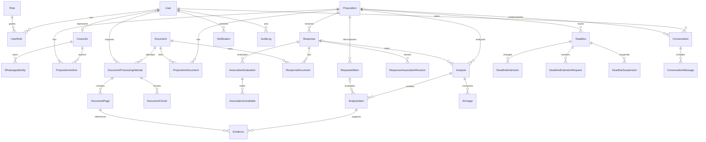

# Fiscaliza AI — Modelo de Dados

## 1. Convenções

- IDs são UUIDs gerados no backend/banco.
- Datas e horas são persistidas como `timestamptz` em UTC; datas administrativas sem horário usam `date`.
- Registros de domínio usam `createdAt`/`updatedAt`; auditoria e versões relevantes são append-only.
- PDFs não são persistidos no PostgreSQL; apenas metadados, hash e chave S3.
- Textos extraídos são separados por página. Um trecho de evidência nunca existe sem `documentId` e `pageNumber` válidos.
- Soft delete é usado apenas onde retenção permitir; documentos e auditoria não são apagados por fluxos comuns.

## 2. Visão relacional

## 3. Identidade e acesso

### `User`

Conta autenticável: `email` único normalizado, `passwordHash`, nome, estado, timestamps de login e revogação. A senha nunca é armazenada ou registrada.

### `Role` e `UserRole`

Papéis iniciais `ADMIN`, `SECRETARIAT`, `COUNCILOR`, `AUDITOR`. A relação N:N evita enum rígido na autorização e permite evolução. O seed cria papéis, não permissões implícitas no frontend.

### `Councilor`

Perfil político/administrativo opcionalmente ligado a um `User`. Guarda nome de exibição, nome legal, partido opcional e período de mandato. A autoria de uma proposição aponta para `Councilor`, não diretamente para `User`.

### `WhatsappIdentity`

Número E.164 normalizado, instância UAZAPI, estado de verificação e vínculo com vereador. `(phoneNumber, instance)` é único. Número desconhecido não cria usuário automaticamente. A Fase 5B usa a identidade como barreira de autorização do WhatsApp: somente identidade ativa **e** verificada, com vereador ativo e usuário `ACTIVE`, pode disparar consulta. O telefone completo nunca é exposto em logs, auditoria, payloads ou no frontend (máscara + hash).

## 4. Proposições e documentos

### `Proposition`

Campos centrais: tipo (`REQUEST`/`INDICATION`), número, ano, protocolo, data, destinatário, assunto, resumo e status. A identidade administrativa continua `(type, number, year)` com unique constraint e índice de consulta. Não foram inventados `origin`, `unit` ou `legislature`: a Câmara deverá decidir se fazem parte da identidade antes de importar fontes em que a numeração possa colidir.

### `PropositionAuthor`

Relação N:N entre proposição e vereador, com papéis `PRIMARY` e `COAUTHOR`. A chave composta impede repetir um vereador, e índice parcial garante no máximo um autor principal por proposição. O serviço exige exatamente um principal e ao menos um autor. Uma proposição com três autores continua sendo um único registro e os três vínculos ficam disponíveis à futura autorização por gabinete.

### `RequestedItem`

Item atômico de verificação, com sequência, texto original, pergunta/ação normalizada, categoria e tipo esperado de resposta. O tipo de proposição determina qual pipeline o cria. Não há merge automático de perguntas distintas.

Desde a Fase 4: `extractionAnalysisId` aponta para a `Analysis` (`REQUEST_EXTRACTION`/`INDICATION_EXTRACTION`) que produziu o item, e `sourceDocumentPageId` referencia a `DocumentPage` imutável de origem — nunca apenas `sourcePage` (número), que permanece como campo de apresentação. `active` permite reextração não destrutiva: uma nova tentativa documental ou versão de prompt marca os itens antigos `active = false` e cria um novo conjunto, sem apagar o histórico. A unicidade de `sequence` por proposição passou a ser um índice parcial sobre `active = true` (ver migration `202608080100_phase4_ai_extraction_analysis`), já que duas gerações de itens podem coexistir.

### `Document`

Metadados do original: nome sanitizado, MIME validado, `storageKey`, SHA-256 único, tamanho, páginas, origem (`UPLOAD`/`INBOX`), autor do upload, estados de segurança/extração/OCR/processamento, textos agregados opcionais e confiança. Também conserva tentativa corrente, erro seguro, timestamps por etapa e `reviewRequired`. `kind` e `accessLevel` preparam classificação e restrição futuras.

O objeto começa em `quarantine/{documentId}/original.pdf`. Somente após `securityStatus = CLEAN` sua chave muda para `documents/{anoUTC}/{documentId}/original.pdf`. Um resultado `SKIPPED`, `INFECTED` ou `FAILED` não libera download.

### `DocumentPage`

Chave `(processingAttemptId, pageNumber)`, além de `documentId`, `extractedText`, `ocrText`, `effectiveText`, fonte efetiva, quantidade de caracteres, score/razão de qualidade, necessidade/estado/confiança de OCR. Páginas começam em 1 e correspondem à ordem física entregue pelo parser. A mesma página lógica pode existir em tentativas diferentes sem sobrescrever a versão histórica.

### `DocumentProcessingAttempt`

Histórico por `(documentId, attempt)`: gatilho (`UPLOAD`, `INBOX` ou `REPROCESS`), estado, solicitante, erro seguro e timestamps. Ele passou a ser o proprietário da versão de páginas/chunks. Reprocessar incrementa a tentativa e não remove derivados concluídos de tentativas anteriores. `AnalysisDocument.processingAttemptId` congela a entrada de uma análise futura e `Evidence.documentPageId` referencia a linha exata com `onDelete: Restrict`.

### `DocumentChunk`

Trecho derivado de uma única página/tentativa, com página, sequência, conteúdo e SHA-256. Na Fase 3, `embedding` permaneceu `NULL`. Na Fase 5A (ver `ADR-002-EMBEDDINGS.md`) o chunk é indexado com `embedding` (coluna física `vector(1536)`, sem suporte direto do Prisma — escrita/leitura por SQL bruto), `embeddingProvider`, `embeddingModel`, `embeddingVersion` e `embeddingHash`. A indexação é incremental e idempotente: o worker pula chunks já indexados com o hash/provider/modelo/versão correntes e só escreve os pendentes da tentativa corrente; a consulta filtra por `embedding_version` e pela tentativa corrente, então reprocessar nunca corrompe evidência histórica. O índice HNSW `document_chunks_embedding_hnsw_idx` (`vector_cosine_ops`) é criado na migration `202608110100_phase5a_embeddings`.

### Vínculos de documento

`PropositionDocument` e `ResponseDocument` permitem mais de um anexo, distinguem documento principal e preservam ordem. Um mesmo objeto deduplicado pode ser referenciado sem duplicar bytes.

## 5. Respostas e associação

### `Response`

Relação N:1 com proposição, nunca 1:1. Guarda tipo (`INITIAL`, `COMPLEMENTARY`, `RECTIFICATION`, `OTHER`), datas, protocolo, remetente, status de associação, confiança e método (`AUTOMATIC`, `MANUAL`). Uma resposta ambígua pode existir sem `propositionId` até revisão.

### `DeadlineExtensionRequest`

Registra o pedido/comunicação de prorrogação: proposição/prazo, data, dias/data solicitados, motivo, documento de suporte, responsável e decisão. Não muda o vencimento. O antigo `ResponseExtension` foi preservado por migration como `LegacyResponseExtension`/`legacy_response_extensions` apenas para compatibilidade; novos fluxos não o utilizam.

### Candidatos de associação

`AssociationEvaluation` congela threshold, margem, pesos, melhor score e segundo score de uma execução. `AssociationCandidate` preserva até dez candidatos, rank, estado e pontuações por sinal (referência explícita, número, ano, tipo, protocolo, assunto e proximidade temporal), além das explicações legíveis. A associação automática só ocorre se o melhor candidato atingir o limiar **e** superar o segundo pela margem mínima; caso contrário, `NEEDS_REVIEW`.

### `ResponseAssociationRevision`

Histórico append-only com proposição/método anterior e novo, ator, motivo e timestamp. `Response.associationVersion` implementa concorrência otimista: uma confirmação baseada em versão antiga retorna conflito em vez de sobrescrever a decisão de outro usuário.

## 6. Análises, revisões e evidências

### `Analysis`

Uma execução versionada para proposição e, quando aplicável, conjunto/resposta. Guarda tipo, estado, confiança, JSON estruturado de resumo, resultado original, resultado corrente, provider/modelo/prompt/versão e `inputHash`. A chave de cache evita nova chamada equivalente.

Desde a Fase 4, `type` também é usado para as execuções de extração (`REQUEST_EXTRACTION`/`INDICATION_EXTRACTION`), que são análises auxiliares próprias, com seu próprio `inputHash` e AnalysisDocument, distintas da análise de resposta (`REQUEST_RESPONSE`/`INDICATION_RESPONSE`) que o usuário aciona por "Executar análise". `currentResult`/`originalResult` guardam, além dos itens, metadados de cobertura (`responseIds`, `documentIds`, `processingAttemptIds`, `pageCountScanned`, `batchCount`, `analysisCutoff`) para auditoria de "o que foi examinado", inclusive quando a conclusão é ausência de resposta.

### `AnalysisItem`

Resultado por `RequestedItem`. Como os status diferem entre requerimentos e indicações, o banco guarda um enum superset validado também pelo tipo de análise. Mantém resultado original e corrente, explicação, confiança e campos de revisão (`reviewedBy`, `reviewedAt`, `reviewReason`). Revisão nunca sobrescreve o original; ela só altera os campos `current*` e cria um `AnalysisRevision` append-only.

### `Evidence`

Liga uma conclusão a `DocumentPage`; guarda trecho curto, motivo e offsets opcionais. A criação valida que a página pertence à tentativa documental congelada da análise e que o trecho é compatível com o texto efetivo da página (normalização controlada de espaços/quebras). Evidência sem trecho pode existir quando a página é visual/ilegível, mas deve explicar a limitação. Toda validação ocorre no worker (`apps/worker/src/ai/evidence-validator.ts`) depois da resposta do LLM; nenhuma evidência é persistida apenas com base na instrução do prompt.

### `AnalysisRevision`

Registro append-only de cada mudança humana, com valor anterior, novo, ator, justificativa e timestamp. O campo corrente acelera leitura; a revisão preserva reconstrução completa.

### `AIUsage`

Provider, modelo, operação (por exemplo `analysis`, `extraction`, `web-answer`, `embedding`), tokens de entrada/saída, latência, custo estimado, moeda, promptVersion, analysisVersion, inputHash e timestamps. Desde a Fase 5A pode apontar para a `ConversationMessage` que gerou o uso (`conversationMessageId`). Não armazena chain-of-thought.

## 7. Prazos

### `Deadline`

Mantém data base, prazo original, prazo atual, estado (`OPEN`, `DUE_SOON`, `OVERDUE`, `EXTENDED`, `SUSPENDED`, `RESPONSE_RECEIVED`, `RESPONDED`), modo de contagem, timezone e versão otimista. `configurationSnapshot` contém chave/versão da configuração, política completa e feriados aplicáveis na criação. Alterações globais posteriores não recalculam prazos existentes.

`RESPONSE_RECEIVED` registra somente que houve resposta protocolada/associada. `RESPONDED` permanece reservado para significado semântico futuro e não é atribuído pela Fase 3.

### `DeadlineExtension`

Evento imutável: prazo anterior, novo prazo, data da concessão, dias, responsável e motivo. O prazo original permanece intacto.

### `Holiday`

Data e nome, com timezone e escopo controlado (`NATIONAL`, `STATE`, `MUNICIPAL`, `INSTITUTIONAL`). `(date, scope)` é único. Feriados são dados administrativos e alterações são auditadas. Finais de semana são tratados pelo calendário, não gravados como feriados.

### `DeadlineSuspension`

Evento histórico com início, fim, motivo, quem suspendeu/retomou e vencimento anterior/novo. Apenas uma suspensão aberta por prazo é permitida por índice parcial. A retomada recompõe dias segundo a política congelada e não destrói o calendário anterior.

## 8. Conversas e notificações

### `Conversation` e `ConversationMessage`

Conversa web (Fase 5A), associada ao usuário e opcionalmente a uma proposição. A `Conversation` guarda canal (`WEB`), título opcional e `lastInteractionAt`; a mensagem guarda papel (`USER`/`ASSISTANT`), texto destinado ao usuário, `sources` JSON (somente páginas validadas pelo worker: `documentId`, `documentPageId`, `pageNumber`), `status`, `provider`, `model`, `answerVersion`, `embeddingVersion`, tokens de entrada/saída, latência, `failureReason` e `inputHash` — a unicidade `(conversationId, role, inputHash)` impede duplicação idempotente da mesma pergunta. Não guardam raciocínio interno do modelo.

Sessão curta (`activePropositionId`, `conversationId`, `lastInteraction`) fica no Redis (`whatsapp:session:{instance}:{identityId}`); a conversa durável fica no PostgreSQL. `AIUsage` pode apontar para a mensagem geradora via `conversationMessageId`. Na Fase 5B, `Conversation` ganhou `whatsappIdentityId` (vínculo auditável do canal WhatsApp) e o `InboundMessage` vinculou-se a identidade, conversa e mensagem gerada.

### `InboundMessage`

Envelope WhatsApp com `messageId` único por instância, hash do telefone e do payload, estado e resposta produzida. É a barreira de idempotência: `(instance, messageId)` único e `payloadHash` detecta o mesmo ID com conteúdo diferente (409). Desde a Fase 5B guarda `identityId`, `conversationId` e `conversationMessageId` para auditoria do fluxo.

### `Notification`

Destinatário de canal (User via `recipientId` ou `WhatsappIdentity` via `identityId`), `type` (`WHATSAPP_CONVERSATION_REPLY`, `RESPONSE_ANALYSIS_COMPLETED`, `DEADLINE_APPROACHING`, `DEADLINE_EXPIRED`), canal, template + `templateVersion`, payload mínimo, `idempotencyKey` único, status, tentativas, `externalMessageId` e timestamps. `destinationPhone` é usado apenas para respostas neutras a números sem identidade. Criada somente depois de `ResponseAnalysisCompleted` (análise de resposta `COMPLETED`) ou dos eventos de prazo. Entrega é assíncrona e repetível sem duplicação externa quando o provedor suporta idempotency key.

### `NotificationDeliveryAttempt`

Histórico append-only de cada tentativa de entrega: `notificationId`, número da tentativa (único por notificação), `status`, `provider`, `externalMessageId` e erro sanitizado. Nunca se depende apenas do `lastError` sobrescrito.

## 9. Configuração, auditoria e eventos

### `SystemSetting`

Chave única, valor JSON, tipo, descrição, versão, ator e timestamps. Configurações iniciais:

- `deadlines.initialResponseDays = 15`
- `deadlines.extensionDays = 15`
- `deadlines.countingMode = CALENDAR_DAYS`
- `deadlines.timezone = America/Sao_Paulo`
- `deadlines.dueSoonDays = 3`
- `analysis.confidence.normal = 0.85`
- `analysis.confidence.warning = 0.60`
- `association.autoThreshold` e `association.minimumMargin`
- limites de upload, OCR e retenção.

Os valores são seed inicial alterável, nunca regra hardcoded no serviço.

### `AuditLog`

Append-only: ator, ação, recurso, ID, estado anterior/posterior redigido, IP, user-agent, requestId e timestamp. Senhas, tokens, chaves, PDFs completos e prompts com dados sensíveis não entram no log.

### `OutboxEvent` e `ProcessedEvent`

Outbox transacional para publicação confiável; consumidor registra evento processado. Payloads carregam IDs, versões e metadados mínimos, não o PDF/texto integral.

## 10. Índices e invariantes críticos

- unique em `Proposition(type, number, year)` e decisão registrada de revisar a chave caso existam múltiplas origens/unidades;
- chave de `PropositionAuthor` em `(propositionId, councilorId)` e um único `PRIMARY` por índice parcial;
- unique em `Document.sha256` e `Document.storageKey`;
- unique em `DocumentPage(processingAttemptId, pageNumber)`;
- unique em `DocumentProcessingAttempt(documentId, attempt)`;
- unique em `DocumentChunk(processingAttemptId, pageNumber, sequence)`; `contentHash` permite cache/controle de derivação;
- um documento principal por proposição/resposta por índices parciais e vínculo físico único por chave composta;
- uma suspensão aberta por prazo e uma concessão por pedido de prorrogação;
- versões otimistas em `Response` e `Deadline` evitam escrita concorrente perdida;
- unique em `RequestedItem(propositionId, sequence)`;
- unique em `InboundMessage(instance, messageId)`;
- unique em `Notification.idempotencyKey` e em `NotificationDeliveryAttempt(notificationId, attempt)`;
- unique em `Analysis.inputHash` por operação/versão quando reutilizável;
- índices em estados de processamento, prazos atuais, autoria, protocolo e timestamps;
- índice HNSW de pgvector (`document_chunks_embedding_hnsw_idx`, `vector_cosine_ops`) criado na Fase 5A; IVFFlat permanece alternativa futura para volume;
- `pageNumber >= 1`, confiança entre 0 e 1 e dias não negativos via validação e constraints SQL;
- associação manual exige ator; revisão exige justificativa; evidência deve pertencer a página existente.

## 11. Retenção e classificação

`accessLevel` começa com `INTERNAL`, `RESTRICTED` e `PUBLIC`, mas nenhum documento é público por inferência. Políticas futuras podem mascarar PII em chunks e respostas de chat sem modificar o original sob retenção legal. Exclusão deve distinguir bytes no S3, derivados, índices e registros sujeitos a auditoria.

## 12. Decisões deliberadamente adiadas

- A unicidade atual de proposição continua `(type, number, year)`. A Câmara deve decidir antes de fontes multiunidade se origem/unidade/legislatura também integram a identidade; a Fase 3 não inventou esse dado institucional.
- O conceito ambíguo `ResponseExtension` foi isolado como legado. Novos pedidos usam `DeadlineExtensionRequest`; somente `DeadlineExtension` altera efetivamente o prazo.
- Provider, dimensão e versão de embeddings agora são configurados e versionados por chunk (`ADR-002-EMBEDDINGS.md`). Permanece adiado o que exigir decisão institucional: mascaramento de PII em chunks/contexto, metadata filtering e quantos pontos semânticos por proposição serão expostos.
