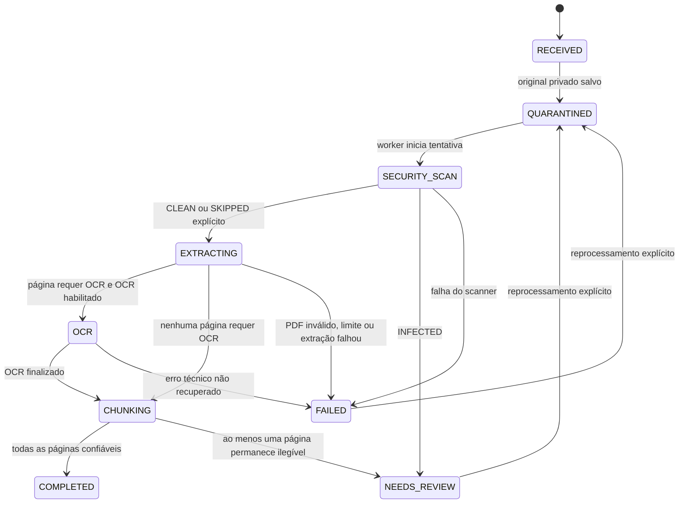

# Pipeline documental

## Escopo da Fase 2

O pipeline recebe exclusivamente PDFs, preserva o original em armazenamento S3 privado e produz `DocumentPage` e `DocumentChunk` sem embeddings. Classificação semântica, associação a proposições, LLM, RAG e WhatsApp permanecem fora desta fase.

Upload HTTP e pasta de entrada usam o mesmo `DocumentIngestionService`. O HTTP encerra após validar, colocar o original em quarentena e gravar, na mesma transação, `Document`, a primeira tentativa e o evento outbox `DocumentUploaded`. O trabalho pesado pertence ao worker.

## Fluxo e transições

`COMPLETED` não volta a uma etapa ativa. `FAILED` e `NEEDS_REVIEW` só voltam a `QUARANTINED` por um pedido explícito de reprocessamento, que cria uma nova `DocumentProcessingAttempt`. O erro anterior permanece nessa tentativa e na auditoria.

## Armazenamento privado e quarentena

- Entrada: `quarantine/{documentId}/original.pdf`.
- Após resultado `CLEAN`: `documents/{UTC-year}/{documentId}/original.pdf`.
- `INFECTED`, `FAILED` e `SKIPPED` permanecem em quarentena.
- Nome original é somente metadado; nunca compõe chave S3 ou caminho temporário.
- Bucket e objetos não possuem ACL pública.
- A API só gera URL assinada curta depois de autorização determinística e resultado de segurança `CLEAN`.
- A movimentação é cópia seguida de remoção da chave de quarentena. O banco só recebe a nova chave depois da cópia confirmar sucesso.

Com `DOCUMENT_ANTIVIRUS_ENABLED=false`, o scanner registra `SKIPPED` e o pipeline pode produzir texto para desenvolvimento, mas o original não fica disponível para download. Produção pode exigir scanner com `DOCUMENT_ANTIVIRUS_REQUIRED=true`.

## Outbox e fila

A transação de ingestão grava:

1. `Document` com SHA-256 único;
2. `DocumentProcessingAttempt` número 1;
3. `AuditLog` sem conteúdo do PDF;
4. `OutboxEvent` `DocumentUploaded`.

O dispatcher do worker bloqueia eventos pendentes com `FOR UPDATE SKIP LOCKED`, publica um job BullMQ com identificador determinístico `document:{documentId}:attempt:{attempt}` e só então marca o evento `PUBLISHED`. Repetir a publicação não cria processamento paralelo porque BullMQ e a tentativa no banco têm chaves idempotentes.

Uma fila tipada `document-processing` foi escolhida em vez de quatro filas encadeadas. Cada job executa etapas explícitas na máquina de estados. Isso reduz janelas de perda entre filas e mantém uma unidade de retry por tentativa documental. OCR continua isolado no worker e tem timeout e concorrência próprios.

## Segurança do conteúdo

Validações anteriores à persistência:

- autorização `ADMIN` ou `SECRETARIAT` para upload;
- limite configurável em bytes;
- extensão permitida, usada somente como sinal adicional;
- assinatura `%PDF-` em magic bytes;
- estrutura PDF válida pelo parser;
- SHA-256 calculado por stream;
- nome original sanitizado como metadado;
- chave S3 gerada pelo sistema;
- limite de páginas após abrir o PDF.

O parser não executa JavaScript incorporado. Conteúdo textual não é escrito em logs. Arquivos temporários usam nomes aleatórios em diretório dedicado e são removidos ao final da tentativa.

## Extração, qualidade e OCR

O parser abre cada página na ordem física do PDF e persiste `pageNumber` começando em 1. Nunca infere páginas depois de concatenar o documento.

`TextQualityAnalyzer` considera quantidade de caracteres, proporção de imprimíveis, fragmentação, diversidade de palavras e densidade mínima. Os thresholds são configuráveis. A mera presença de um cabeçalho não impede OCR.

Regra determinística de `effectiveText`:

1. extração digital suficiente: `effectiveText = extractedText` e fonte `EXTRACTED`;
2. extração insuficiente e OCR de melhor qualidade: `effectiveText = ocrText` e fonte `OCR`;
3. ambos insuficientes: conserva a melhor leitura disponível, marca revisão e nunca inventa texto;
4. ambos vazios: texto efetivo vazio e fonte `EMPTY`.

O provider local usa Poppler para renderizar somente as páginas necessárias e Tesseract para OCR. O idioma inicial é configurável (`por` ou `por+eng`). A imagem Docker do worker contém esses binários; execução local exige que estejam instalados ou que OCR seja desabilitado explicitamente.

## Chunks

Chunking ocorre por página, após escolher o texto efetivo. Primeiro tenta limites de parágrafo, linha e sentença; se necessário aplica tamanho e overlap configuráveis. Um chunk nunca atravessa página e guarda `documentId`, `pageId`, `pageNumber`, `sequence`, conteúdo e SHA-256. `embedding` permanece `NULL` até decisão arquitetural da Fase 5.

## Watcher

O worker observa somente o primeiro nível de `DOCUMENT_INBOX_PATH`. Apenas entradas `.pdf` são candidatas; marcadores e diretórios são ignorados. Antes da ingestão, uma verificação explícita acompanha tamanho e `mtime` pelo intervalo configurado, reinicia a janela ao detectar mudança e aplica timeout. Assim, a correção não depende apenas de eventos do filesystem em volumes Docker/Windows. O watcher usa a mesma ingestão do upload e move a entrada para:

- `processed/` quando aceita;
- `processed/duplicates/` quando o SHA já existe;
- `rejected/` quando inválida.

Movimentos são feitos dentro do volume da inbox e usam nomes resolvidos pelo sistema para impedir traversal e loops de reprocessamento.
