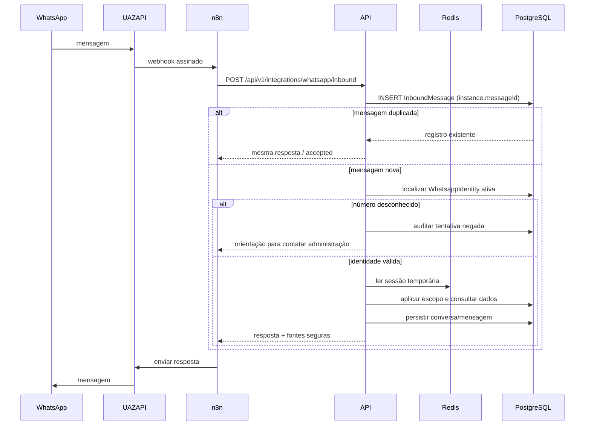
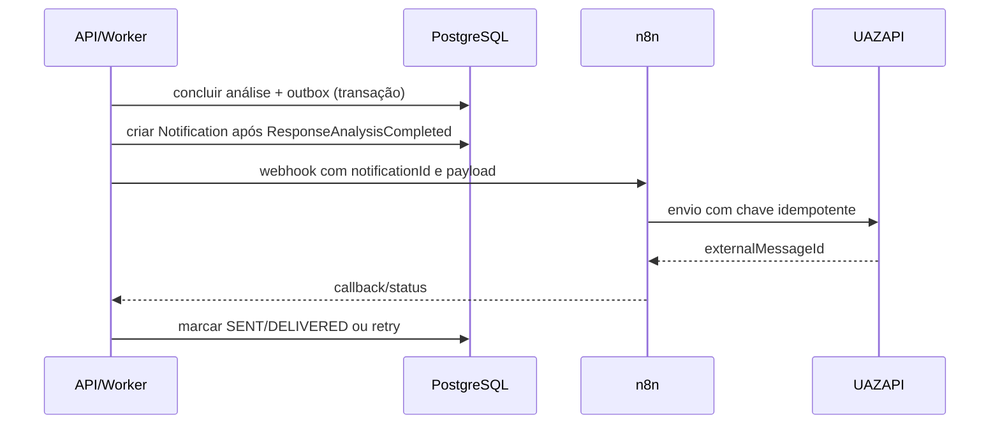

# Fiscaliza AI — Fluxos de WhatsApp

## 1. Responsabilidades

- **UAZAPI:** recebe/envia mensagens WhatsApp.
- **n8n:** valida envelope, transforma payload, chama backend e faz entrega/retry operacional.
- **Backend:** idempotência, identidade, autorização, sessão, contexto, consulta, IA, auditoria e notificação.

Regra crítica nunca existe apenas no n8n.

## 2. Mensagem recebida



Contrato canônico:

```json
{
  "messageId": "wamid.example",
  "phone": "+5511999999999",
  "text": "O que não responderam?",
  "timestamp": "2026-03-20T14:30:00-03:00",
  "instance": "camara-principal",
  "metadata": {}
}
```

O endpoint exige autenticação de integração (HMAC-SHA256 sobre `timestamp.body`, comparação constant-time, janela contra replay) e validação de timestamp/assinatura. `(instance, messageId)` é idempotente: o mesmo ID com o mesmo `payloadHash` retorna o mesmo resultado; o mesmo ID com payload diferente gera `409` e auditoria. O envelope guarda apenas `phoneHash` e `payloadHash`.

## 3. Identidade e sessão

O telefone é normalizado para E.164. Apenas `WhatsappIdentity` ativa e verificada acessa consultas. Número desconhecido recebe mensagem neutra, sem confirmar existência de vereador ou documento.

Chave Redis: `whatsapp:session:{instance}:{identityId}` com TTL configurável. Conteúdo mínimo:

```json
{
  "activePropositionId": "uuid",
  "conversationId": "uuid",
  "lastInteraction": "2026-03-20T17:30:00Z"
}
```

Selecionar “requerimento 38/2026” só ativa contexto se houver exatamente uma proposição autorizada. Ambiguidade por tipo/ano gera pergunta de esclarecimento. Linguagem natural permanece disponível; não há menu rígido.

## 4. Perguntas e fontes

Consultas estruturadas usam banco primeiro. Perguntas sobre conteúdo usam análise existente e RAG com filtro por escopo. Respostas incluem fontes compactas, por exemplo: `Fonte: Resposta ao Requerimento 38/2026, p. 7.` Links autenticados podem ser oferecidos, mas URLs assinadas de arquivo não são enviadas quando expõem acesso além da sessão.

## 5. Número desconhecido

Resposta padrão configurável:

> Este número não está habilitado para consultas no Fiscaliza AI. Entre em contato com a administração da Câmara para solicitar acesso.

Nenhuma busca documental ou chamada de LLM é executada.

## 6. Notificação de resposta analisada



Mensagem só é criada após análise concluída:

```text
📄 Resposta recebida — Requerimento 38/2026

Assunto: Manutenção da frota

A análise identificou:
✅ 1 respondido
🟡 1 parcialmente respondido
🔴 1 sem resposta identificada

Resumo:
{{shortSummary}}

Você pode me perguntar qualquer coisa sobre o requerimento ou a resposta.
```

## 7. Alertas de prazo

O backend calcula prazo/estado e emite `DeadlineApproaching` ou `DeadlineExpired` com destinatários já autorizados. n8n apenas formata e entrega. Deduplicação usa `deadlineId + eventType + dueDate + recipientId`.

## 8. Workflows n8n previstos

Em `infra/n8n` são mantidos exemplos importáveis (sem credenciais):

1. `whatsapp-inbound.workflow.example.json`: UAZAPI → normalização → `POST /api/v1/integrations/whatsapp/inbound` (assinado) → resposta ao webhook.
2. `notification-delivery.workflow.example.json` (consolidado): webhook assinado do backend (`/notification-delivery`) → UAZAPI (credential store) com `idempotencyKey` → `POST /integrations/whatsapp/delivery-callback` com `SENT`/`externalMessageId` → `202`. Atende respostas de conversa, análises de resposta e alertas de prazo.
3. `response-analysis-notification.workflow.example.json` e `deadline-alert.workflow.example.json`: referências de filtro por `notificationType` que delegam ao fluxo consolidado.

Credenciais ficam no credential store do n8n, nunca nos JSONs versionados. A `UAZAPI_TOKEN` não existe no backend; o n8n a injeta no env/credenciais.

## 8.1. Validação do contrato externo

O contrato real da UAZAPI **não foi validado neste ambiente** (sem credenciais). O backend foi implementado e testado contra fixtures sintéticas e contra os contratos documentados nos workflows de exemplo; **a integração externa real não é declarada validada** e exige smoke test com a instalação real antes de produção (ver `docs/PHASE_5B_REPORT.md`).

## 9. Falhas e segurança

- Timeout da IA retorna confirmação de processamento quando apropriado; mensagem permanece registrada.
- Falha de UAZAPI mantém `Notification` pendente e usa retry com backoff limitado (ver `docs/NOTIFICATION_DELIVERY.md`).
- Callbacks de status validam transições: DELIVERED é terminal e um callback atrasado nunca o regride para SENT/FAILED.
- Payloads têm limite de tamanho; anexos recebidos não são ingeridos pelo endpoint textual sem fluxo explícito.
- Logs redigem telefone (máscara), texto sensível e tokens; nenhum telefone completo ou payload integral entra em auditoria/API/painel.
- Rate limit por integração, telefone e IP reduz abuso.
- Comandos que alterem dados exigirão confirmação/autorização explícita; o MVP do WhatsApp é prioritariamente de consulta.
